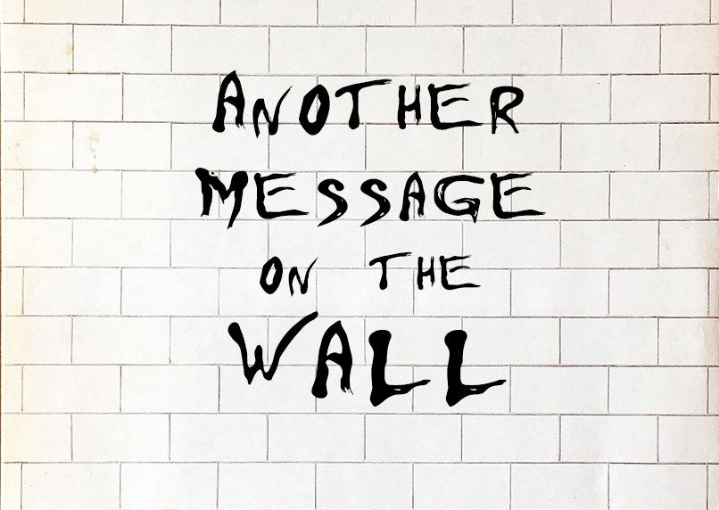

# Another Message in the Wall
   

A simple messaging system that allows users to... You guessed it, post messages to a wall.

### Required Functionality Overview:
* [x]	Display list of existing messages (message content and entered name and email)
* [x]	List of messages sorted most recent first
* [x]	Messages should be paginated, 10 per page
* [ ]	Form to post message has fields for name, email, and message
* [ ]	Form validates name, email, and message as required fields, email is a valid email
* [x]	Messages are stored in a database
* [ ]	No restrictions on use of back-end or front-end frameworks, as long as back-end is in PHP
* [ ]	Code pushed to Github, bitbucket, or other online code repository
* [ ]	Optional: authentication and/or deleting messages

### Additional Functionality Overview:
* [x] User registration & authentication
* [x] User email verification on registration
* [x] Username & email unique validation on registration

## Codebase Overview
- Laravel 5.7.x
- tbd

## Usage 
#### General Debugging
The application comes with [Laravel Telescope](https://github.com/laravel/telescope/) pre-installed in order to better view what's happening under the hood.  To access the telescope dashboard, just navigate to `http://localhost:8000/telescope` and that's it! 

#### Email verification
The application includes the default email verification using by the `MustVerifyEmail` trait in  Laravel 5.7.  Since there currently aren't any smtp drivers setup to handle email, email verifications can be viewed and tested via [Laravel Telescope](https://github.com/laravel/telescope/) by navigating to `http://localhost:8000/telescope/mail` during the registration process. 

